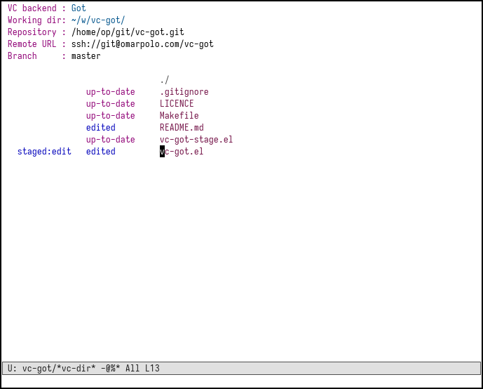

# vc-got

This is an Emacs VC back-end for the [Game of
Tree](http://gameoftrees.org/) version control system.

------

To start using it, you need to add `Got` to `vc-handled-backends` and
make sure that `vc-got` is within your `load-path`.  You shouldn't
require the library.

```emacs-lisp
(add-to-list 'vc-handled-backends 'Got)
```

It's highly recommended to add `".got"` to the list of
`vc-directory-exclusion-list`.

```emacs-lisp
(add-to-list 'vc-directory-exclusion-list ".got")
```

With `use-package` something like this should be enough:

```emacs-lisp
(use-package vc-got
  :load-path "/path/to/vc-got/"
  :defer t
  :init
  (add-to-list 'vc-handled-backends 'Got)
  (add-to-list 'vc-directory-exclusion-list ".got"))
```

## Drawbacks

While I've been using this backend on a daily basis for the last
months, there are some rough edges.  Fetching updates in particular is
one action that *at the moment* is better to do by hand.  Pushing,
committing, blaming etc on the other hand are fully functional.


## Stage hunks

Unlike other VC backends, `vc-got` is able to stage and commit
individual changes.  It's still WIP, but usable.

 - `vc-got-stage-files` guides the user through the stage process,
   like `got stage -p` (or `git add -p`).  It operates on the current
   file or on the marked ones in `*vc-dir*`
 - `vc-got-stage-unstage` is similar, except that it un-stages the
   changes.
 - `vc-got-stage-diff` show the staged diff
 - `vc-got-stage-commit` commits the staged changes

Here's an example of the `*vc-dir*` buffer when some edits were staged
on a file



and an example of the interactive stage operation with
`vc-got-stage-files`


## Contributing

The long-term plan is to get this into Emacs.  This means that to
avoid possible problems, a GNU copyright assignment is required.  It's
really easy to get one (just send an email), and having one will allow
you to make further contribution to Emacs itself or to various
other packages.
